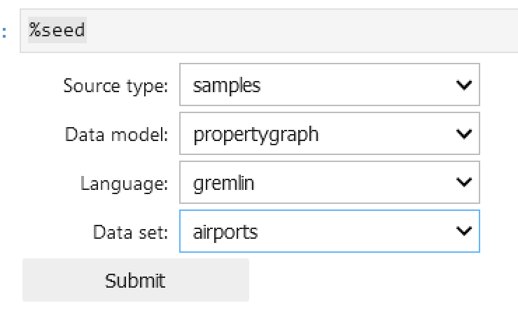
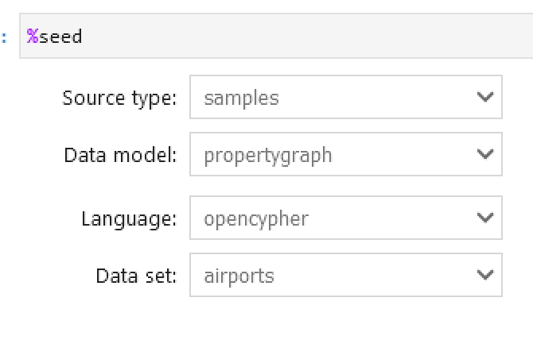

# **Amazon Neptune Utility for GraphQL&trade; Tests - v2.0.0**

The Amazon Neptune Utility for GraphQL project contains unit and integration
tests. When contributing changes to the project, one should ensure that these
tests are updated accordingly and are successful before opening a pull request.

All unit and integration tests can be executed with the following command:

```
npm test
```

## Unit Tests

Unit tests do not require a neptune db cluster or graph and can be executed with
the following command:

```
npm run test:unit
```

## Automated Integration Tests

Integration tests execute against a live neptune db cluster or graph and require
the following prerequisites to run:

1. test dependencies installed by executing `npm install` from the `test`
   directory
2. neptune db cluster or graph which is accessible from the machine running the
   tests and
   is [loaded with the airports sample dataset](#loading-airports-sample-data-into-neptune)
   3, AWS credentials configured appropriately on the machine running the tests
   to allow query access to the neptune db or cluster
4. AWS IAM configured to allow creation of AWS resources necessary to deploy an
   App Sync API
5. environment variables `AIR_ROUTES_DB_HOST` and `AIR_ROUTES_DB_PORT` set to
   identify the neptune db cluster or graph, for example:

```
# neptune db cluster
export AIR_ROUTES_DB_HOST=air-routes.cluster-123.us-west-2.neptune.amazonaws.com
export AIR_ROUTES_DB_PORT=8182
```

```
# neptune analytics graph
export AIR_ROUTES_DB_HOST=g-abc123.us-west-2.neptune-graph.amazonaws.com
export AIR_ROUTES_DB_PORT=8182
```

To execute the integration tests use the following command:

```
npm run test:integration
```

## Manual Integration Tests

In addition to the automated integration tests, there are manual integration
tests that can be run against live AWS AppSync APIs and Apollo Server instances
that were deployed via the Amazon Neptune Utility for GraphQL. These tests are
useful for validating deployed GraphQL APIs that are interfacing Neptune db or
analytics graphs loaded with the airports sample data.

### AppSync Manual Tests

These tests execute queries against a deployed AWS AppSync API:

#### Standard AppSync Queries

```
npm run test:manual -- test/appSyncAirRoutesQueries.manual.test.js
```

#### Custom AppSync Queries

```
npm run test:manual -- test/appSyncCustomAirRoutesQueries.manual.test.js
```

#### All AppSync Queries

```
npm run test:manual -- test/appSync*.manual.test.js
```

**Prerequisites for AppSync tests:**

- Set environment variables:
  ```
  export APP_SYNC_API_ID=your-appsync-api-id
  export APP_SYNC_API_KEY=your-api-key
  export APP_SYNC_REGION=your-aws-region
  ```

### Apollo Server Manual Tests

These tests execute queries against a local Apollo Server instance:

#### Standard Apollo Queries

```
npm run test:manual -- test/apolloAirRoutesQueries.manual.test.js
```

#### Custom Apollo Queries

```
npm run test:manual -- test/apolloCustomAirRoutesQueries.manual.test.js
```

#### All Apollo Queries

```
npm run test:manual -- test/apollo*.manual.test.js
```

### Test Query Suites

Both test suites use JSON files containing GraphQL queries and expected results:

- **`air-routes-queries.json`**: Standard queries including filters, sorting,
  pagination, variables, and fragments
- **`custom-air-routes-queries.json`**: Custom queries using `@graphQuery`
  directives, Gremlin queries, and custom field resolvers. These queries assume
  that the utility was executed with option
  `--input-schema-changes-file ./test/air-routes-changes.json`

## Loading Airports Sample Data Into Neptune

The easiest way to load the airports sample data into Neptune is using
the [%seed line magic](https://docs.aws.amazon.com/neptune/latest/userguide/notebooks-magics.html#notebooks-line-magics-seed)
in a Neptune notebook. To set up a Neptune notebook
see [Using Amazon Neptune with graph notebooks](https://docs.aws.amazon.com/neptune/latest/userguide/graph-notebooks.html)
and [Using notebooks with Neptune Analytics](https://docs.aws.amazon.com/neptune-analytics/latest/userguide/notebooks.html).


> [!TIP]
> The integration tests expect neptune db clusters to be loaded with the
> airports `gremlin` sample dataset and neptune analytics graphs to be loaded
> with
> the airports `opencypher` sample dataset (the gremlin airports dataset is not
> available for neptune analytics).



