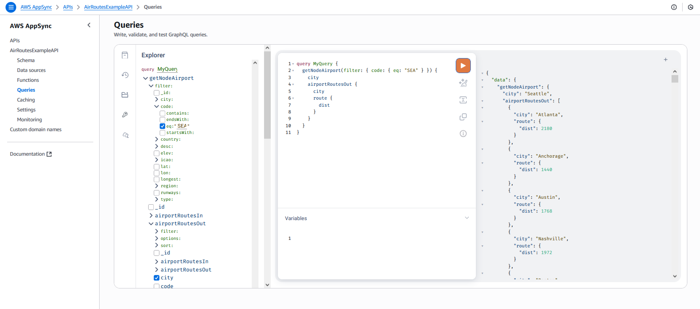
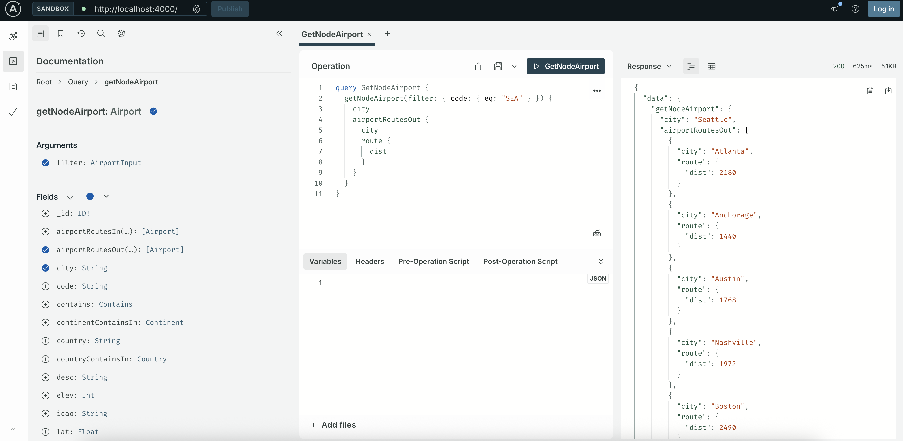

# Air Routes Example: Starting from a Neptune database with data - v2.0.0

Amazon Neptune uses the Air Routes dataset in several Notebook tutorials. If you
don't have a Neptune database with the Air Routes data you can create a new
database, and follow one of the Notebook tutorials to seed it with the Air
Routes data.

Then, you can run the Neptune GraphQL Utility to create an AppSync GraphQL 
API or generate Apollo Server artifacts.

**AppSync** command
```
neptune-for-graphql \
  --input-graphdb-schema-neptune-endpoint <your-neptune-database-endpoint:port> \
  --create-update-aws-pipeline \
  --create-update-aws-pipeline-name AirRoutesExample \
  --output-resolver-query-https
```

**Apollo** command
```
neptune-for-graphql \
  --input-graphdb-schema-neptune-endpoint <your-neptune-database-endpoint:port> \
  --create-update-apollo-server \
  --output-resolver-query-https
```

The utility will log the graph database schema it finds, 
the files it creates, and any AWS resources it creates or modifies during execution. 
If you ever want to run the command while logging only errors, 
use the `--quiet` CLI option.


For **AppSync**, the utility creates these files naming them based on the
`--create-update-aws-pipeline-name` option, in our case `AirRoutesExample`:

| *file*                                 | *description*                        |
|----------------------------------------|--------------------------------------|
| AirRoutes.zip                          | the Lambda code zip file             |
| AirRoutesExample.source.schema.graphql | the GraphQL schema with directives   |
| AirRoutesExample.schema.graphql        | the GraphQL schema                   |
| AirRoutesExample.resolver.graphql.js   | the JavaScript resolver              |
| AirRoutesExample.neptune.schema.json   | the graph schema it discovered       |
| AirRoutesExample-resources.json        | the list of AWS Resources it created |

For the **Apollo Server**, the utility creates the files below while naming
them based on the name of your Neptune database. For example, if the
Neptune database name was `air-routes-example`:

| *file*                                   | *description*                        |
|------------------------------------------|--------------------------------------|
| apollo-server-air-routes-example-<timestamp>.zip                   | the Apollo Server zip file           |
| air-routes-example.source.schema.graphql | the GraphQL schema with directives   |
| air-routes-example.schema.graphql        | the GraphQL schema                   |
| air-routes-example.resolver.graphql.js   | the JavaScript resolver              |
| air-routes-example.neptune.schema.json   | the graph schema it discovered       |

## The graph schema it discovered

Below is the content of the file, `AirRoutesExample.neptune.schema.json` (or `air-routes-example.neptune.schema.json` for Apollo Server). The file contains nodes, edges, properties, 
and edges cardinality. The utility then uses this data to inference the GraphQL schema.

```json
{
  "nodeStructures": [
    {
      "label": "continent",
      "properties": [
        {
          "name": "code",
          "type": "String"
        },
        {
          "name": "type",
          "type": "String"
        },
        {
          "name": "desc",
          "type": "String"
        }
      ]
    },
    {
      "label": "country",
      "properties": [
        {
          "name": "code",
          "type": "String"
        },
        {
          "name": "type",
          "type": "String"
        },
        {
          "name": "desc",
          "type": "String"
        }
      ]
    },
    {
      "label": "version",
      "properties": [
        {
          "name": "date",
          "type": "String"
        },
        {
          "name": "code",
          "type": "String"
        },
        {
          "name": "author",
          "type": "String"
        },
        {
          "name": "type",
          "type": "String"
        },
        {
          "name": "desc",
          "type": "String"
        }
      ]
    },
    {
      "label": "airport",
      "properties": [
        {
          "name": "country",
          "type": "String"
        },
        {
          "name": "longest",
          "type": "Int"
        },
        {
          "name": "code",
          "type": "String"
        },
        {
          "name": "city",
          "type": "String"
        },
        {
          "name": "elev",
          "type": "Int"
        },
        {
          "name": "icao",
          "type": "String"
        },
        {
          "name": "lon",
          "type": "Float"
        },
        {
          "name": "runways",
          "type": "Int"
        },
        {
          "name": "region",
          "type": "String"
        },
        {
          "name": "type",
          "type": "String"
        },
        {
          "name": "lat",
          "type": "Float"
        },
        {
          "name": "desc",
          "type": "String"
        }
      ]
    }
  ],
  "edgeStructures": [
    {
      "label": "contains",
      "properties": [],
      "directions": [
        {
          "from": "continent",
          "to": "airport",
          "relationship": "ONE-MANY"
        },
        {
          "from": "country",
          "to": "airport",
          "relationship": "ONE-MANY"
        }
      ]
    },
    {
      "label": "route",
      "properties": [
        {
          "name": "dist",
          "type": "Int"
        }
      ],
      "directions": [
        {
          "from": "airport",
          "to": "airport",
          "relationship": "MANY-MANY"
        }
      ]
    }
  ]
}
```

## The GraphQL schema with directives

Below is the GraphQL schema with directives, inferred by the utility.

- The Air Routes nodes' labels are lower case, and GraphQL type names are
  typically in Pascal case, so the utility added the *@alias* directive to map
  the names between GraphQL and the Neptune Database.
- Because the node labelled *continent* is connected to the *airport* using the
  edge *contains* and the cardinality is one to many, you can see the directive
  *@relationship* in the GraphQL type *Continent* and new field names
  *airportContainssOut* returning an array of *Airport*. The type Airport has an
  opposite field called *continentContainsIn* as single *Continent*. This tuple
  declaration will enable you to query the *Continent* from the *Airport* and
  the list of *Airport*/s from a *Continent*.
- The edge *route* that connects an *airport* to another *airport* has a
  property called *dist*. You can find it in the type *Route*, and is added to
  the type *Airport* as well. We will later see how to query it.
- For each type the utility also added inputs, which are used as helpers for
  queries and mutations.
- For each node label the utility added two queries. One to retrieve a single
  node/type using an id or any of the type fields listed in the input, and the
  second to retrieve multiple values, again filtered using the input of that
  node/type.
- For each node three mutations: create, update and delete. Selecting the node
  to delete using an id or the input for that node/type.
- For edges two mutations: connect and delete. They take as input the ids of the
  from and to node, and in case the edge type has properties the correspondent
  input.

> [!TIP]
> The queries and mutations you see below are recognized by the resolver based
> on the name pattern. If you need to customize it, first look at the
> documentation section: *Customize the GraphQL schema with directives*.

## Air Routes GraphQL Schema

```graphql
enum SortingDirection {
    ASC
    DESC
}

type Continent @alias(property: "continent") {
    _id: ID! @id
    code: String
    type: String
    desc: String
    airportContainssOut(filter: AirportInput, options: Options, sort: [AirportSort!]): [Airport] @relationship(edgeType: "contains", direction: OUT)
    contains: Contains
}

input ContinentInput {
    _id: ID @id
    code: StringScalarFilters
    type: StringScalarFilters
    desc: StringScalarFilters
}

input ContinentCreateInput {
    _id: ID @id
    type: String
    code: String
    desc: String
}

input ContinentUpdateInput {
    _id: ID! @id
    type: String
    code: String
    desc: String
}

input ContinentSort {
    _id: SortingDirection
    type: SortingDirection
    code: SortingDirection
    desc: SortingDirection
}

type Country @alias(property: "country") {
    _id: ID! @id
    code: String
    type: String
    desc: String
    airportContainssOut(filter: AirportInput, options: Options, sort: [AirportSort!]): [Airport] @relationship(edgeType: "contains", direction: OUT)
    contains: Contains
}

input CountryInput {
    _id: ID @id
    code: StringScalarFilters
    type: StringScalarFilters
    desc: StringScalarFilters
}

input CountryCreateInput {
    _id: ID @id
    type: String
    code: String
    desc: String
}

input CountryUpdateInput {
    _id: ID! @id
    type: String
    code: String
    desc: String
}

input CountrySort {
    _id: SortingDirection
    type: SortingDirection
    code: SortingDirection
    desc: SortingDirection
}

type Version @alias(property: "version") {
    _id: ID! @id
    date: String
    code: String
    author: String
    type: String
    desc: String
}

input VersionInput {
    _id: ID @id
    date: StringScalarFilters
    code: StringScalarFilters
    author: StringScalarFilters
    type: StringScalarFilters
    desc: StringScalarFilters
}

input VersionCreateInput {
    _id: ID @id
    date: String
    code: String
    author: String
    type: String
    desc: String
}

input VersionUpdateInput {
    _id: ID! @id
    date: String
    code: String
    author: String
    type: String
    desc: String
}

input VersionSort {
    _id: SortingDirection
    date: SortingDirection
    code: SortingDirection
    author: SortingDirection
    type: SortingDirection
    desc: SortingDirection
}

type Airport @alias(property: "airport") {
    _id: ID! @id
    country: String
    longest: Int
    code: String
    city: String
    elev: Int
    icao: String
    lon: Float
    runways: Int
    region: String
    type: String
    lat: Float
    desc: String
    continentContainsIn: Continent @relationship(edgeType: "contains", direction: IN)
    countryContainsIn: Country @relationship(edgeType: "contains", direction: IN)
    airportRoutesOut(filter: AirportInput, options: Options, sort: [AirportSort!]): [Airport] @relationship(edgeType: "route", direction: OUT)
    airportRoutesIn(filter: AirportInput, options: Options, sort: [AirportSort!]): [Airport] @relationship(edgeType: "route", direction: IN)
    contains: Contains
    route: Route
}

input AirportInput {
    _id: ID @id
    country: StringScalarFilters
    longest: Int
    code: StringScalarFilters
    city: StringScalarFilters
    elev: Int
    icao: StringScalarFilters
    lon: Float
    runways: Int
    region: StringScalarFilters
    type: StringScalarFilters
    lat: Float
    desc: StringScalarFilters
}

input AirportCreateInput {
    _id: ID @id
    country: String
    longest: Int
    code: String
    city: String
    elev: Int
    icao: String
    lon: Float
    runways: Int
    region: String
    type: String
    lat: Float
    desc: String
}

input AirportUpdateInput {
    _id: ID! @id
    country: String
    longest: Int
    code: String
    city: String
    elev: Int
    icao: String
    lon: Float
    runways: Int
    region: String
    type: String
    lat: Float
    desc: String
}

input AirportSort {
    _id: SortingDirection
    country: SortingDirection
    longest: SortingDirection
    code: SortingDirection
    city: SortingDirection
    elev: SortingDirection
    icao: SortingDirection
    lon: SortingDirection
    runways: SortingDirection
    region: SortingDirection
    type: SortingDirection
    lat: SortingDirection
    desc: SortingDirection
}

type Contains @alias(property: "contains") {
    _id: ID! @id
}

type Route @alias(property: "route") {
    _id: ID! @id
    dist: Int
}

input RouteInput {
    dist: Int
}

input Options {
    limit: Int
}

input StringScalarFilters {
    eq: String
    contains: String
    endsWith: String
    startsWith: String
}

type Query {
    getNodeContinent(filter: ContinentInput): Continent
    getNodeContinents(filter: ContinentInput, options: Options, sort: [ContinentSort!]): [Continent]
    getNodeCountry(filter: CountryInput): Country
    getNodeCountrys(filter: CountryInput, options: Options, sort: [CountrySort!]): [Country]
    getNodeVersion(filter: VersionInput): Version
    getNodeVersions(filter: VersionInput, options: Options, sort: [VersionSort!]): [Version]
    getNodeAirport(filter: AirportInput): Airport
    getNodeAirports(filter: AirportInput, options: Options, sort: [AirportSort!]): [Airport]
}

type Mutation {
    createNodeContinent(input: ContinentInput!): Continent
    updateNodeContinent(input: ContinentInput!): Continent
    deleteNodeContinent(_id: ID!): Boolean
    createNodeCountry(input: CountryInput!): Country
    updateNodeCountry(input: CountryInput!): Country
    deleteNodeCountry(_id: ID!): Boolean
    createNodeVersion(input: VersionInput!): Version
    updateNodeVersion(input: VersionInput!): Version
    deleteNodeVersion(_id: ID!): Boolean
    createNodeAirport(input: AirportInput!): Airport
    updateNodeAirport(input: AirportInput!): Airport
    deleteNodeAirport(_id: ID!): Boolean
    connectNodeContinentToNodeAirportEdgeContains(from_id: ID!, to_id: ID!): Contains
    deleteEdgeContainsFromContinentToAirport(from_id: ID!, to_id: ID!): Boolean
    connectNodeCountryToNodeAirportEdgeContains(from_id: ID!, to_id: ID!): Contains
    deleteEdgeContainsFromCountryToAirport(from_id: ID!, to_id: ID!): Boolean
    connectNodeAirportToNodeAirportEdgeRoute(from_id: ID!, to_id: ID!, edge: RouteInput!): Route
    updateEdgeRouteFromAirportToAirport(from_id: ID!, to_id: ID!, edge: RouteInput!): Route
    deleteEdgeRouteFromAirportToAirport(from_id: ID!, to_id: ID!): Boolean
}

schema {
    query: Query
    mutation: Mutation
}
```

## Let's use our new GraphQL API from AppSync console

Below is a snapshot of the AppSync Queries console used to test our new GraphQL
API named *AirRoutesExampleAPI*. In the middle window, the Explorer shows you
the queries and mutations. You can then pick a query, the input parameters and
the return fields.

In this case it formed a GraphQL query that is looking for one *Airport*, with
*code* equal *SEA*, and return the *city*, the outbound flights *airportsOut*,
and for each destination the *city* and the *route* distance, *dist*. As
mentioned earlier, in the graph database the nodes *airport* are connected with
the edge type *route*, and *dist* is a property of the edge.

You can then follow the AppSync documentation on how to call the GraphQL API
from your application, enable caching and other AppSync API features.



## Using the new GraphQL API from the Apollo Server

If you had opted to use Apollo Server instead of App Sync with the `--create-update-apollo-server` option, you will need to execute the following steps to start the Apollo Server and access the Queries console:

1. unzip apollo-server-<identifier>-<timestamp>.zip
2. change directory into the unzipped folder
3. execute `npm install` to install required dependencies
4. execute `node index.mjs` to start the Apollo Server
5. access the graphQL application in a browser by visiting http://localhost:4000/

Below is a snapshot of the Apollo Server Queries console used to test our new GraphQL
API. On the left, the Documentation panel shows you the queries and mutations. 
You can then pick a query, the input parameters and the return fields.

The GraphQL query generated in the Operations panel follows the same pattern as the AppSync GraphQL query above.

