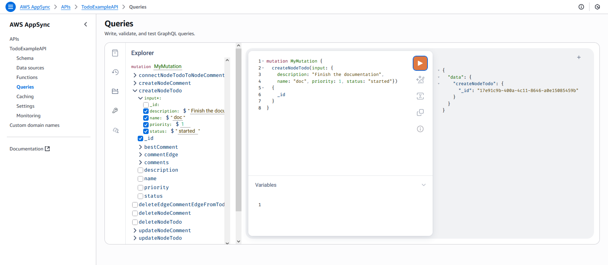
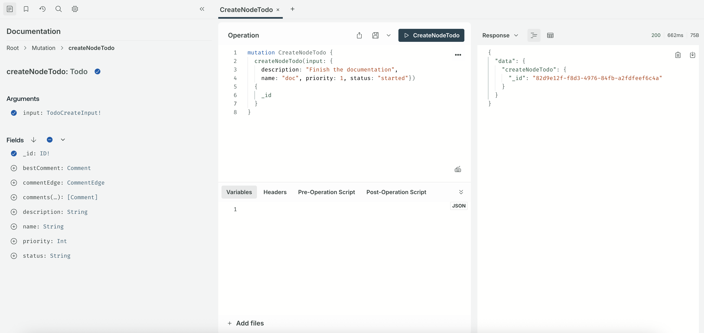
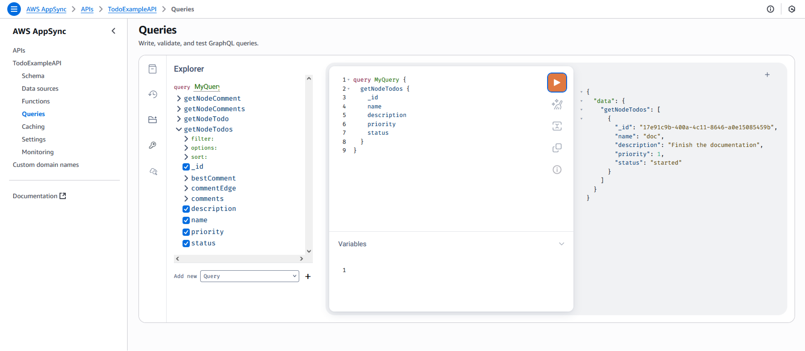
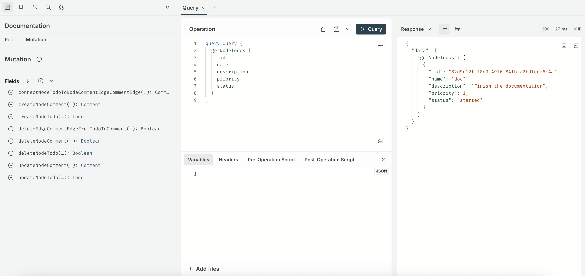
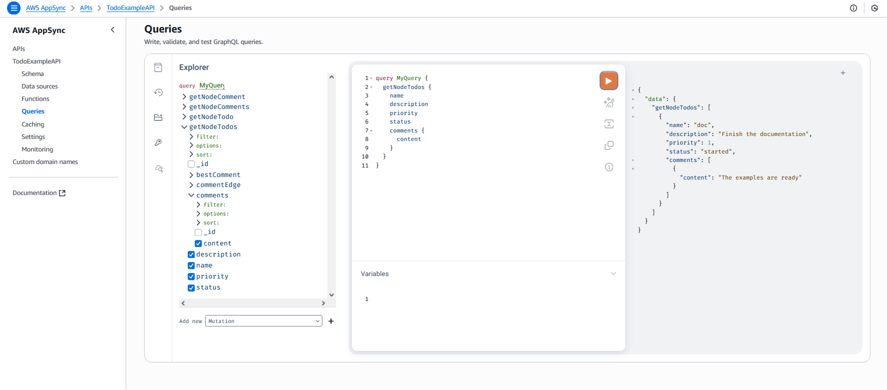
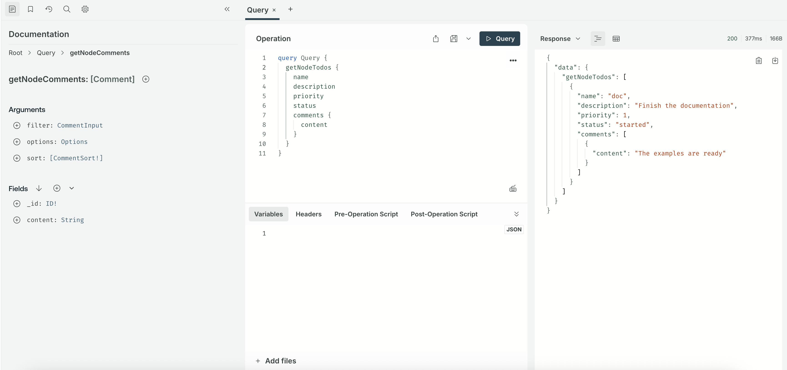

# TODO Example: Starting from a GraphQL schema with no directives - v2.0.0

You can start from a GraphQL schema without directives and an empty Neptune
database. The utility will inference directives, input, queries and mutations,
and create the GraphQL API. Then, you can use GraphQL to create, mutate and
query the data stored in a Neptune database without the need to know how to use
a graph query language.

In this example we start from a TODO GraphQL schema, that you can find in
the [samples](https://github.com/aws/amazon-neptune-for-graphql/blob/main/samples/todo.schema.graphql).
Includes two types: *Todo* and *Comment*. The *Todo* has a field *comments* as
list of *Comment* type.

```graphql
type Todo {
    name: String
    description: String
    priority: Int
    status: String
    comments: [Comment]
}

type Comment {
    content: String
}

```

Let's now run this schema through the utility and create the GraphQL API in AWS AppSync
and Apollo Server
*(Note: please provide a reachable, empty Neptune database endpoint)*

**AppSync** command:
```
neptune-for-graphql \
  --input-schema-file ./samples/todo.schema.graphql \
  --create-update-aws-pipeline \
  --create-update-aws-pipeline-name TodoExample \
  --create-update-aws-pipeline-neptune-endpoint <your-neptune-database-endpoint:port> \
  --output-resolver-query-https
```

**Apollo** command:
```
neptune-for-graphql \
  --input-schema-file ./samples/todo.schema.graphql \
  --create-update-apollo-server-neptune-endpoint <your-neptune-database-endpoint:port> \
  --create-update-apollo-server \
  --output-resolver-query-https
```

For **Apollo** the utility should have generated a zip file containing all the resources.
After unzipping the file you get a complete Apollo Server application that
provides the same GraphQL API capabilities as AppSync but as a self-hosted,
customizable solution that you can deploy anywhere.

For details on starting the Apollo server, refer to [Generate Apollo Artifacts](https://github.com/aws/amazon-neptune-for-graphql/blob/main/README.md#generate-apollo-server-artifacts). After the server is started the graphQL application can be accessed in a browser by visiting `http://localhost:4000/`. 

For **AppSync**, the utility created a new file in the *output* folder called
*TodoExample.source.schema.graphql* and the GraphQL API in AppSync. For the
**Apollo Server**, the utility created a new file in the *output* folder called
*\<neptune-database-name\>.source.schema.graphql*.

As you can see below, the utility inferences:

- In the type *Todo* it added *@relationship* for a new type *CommentEdge*. This
  is instructing the resolver to connect *Todo* to *Comment* using a graph
  database edge called *CommentEdge*.
- A new input called *TodoInput* was added to help with queries.
- Two other new input types called *TodoCreateInput* and *TodoUpdateInput* were
  added to help with mutations.
- The new input *TodoSort* was added to allow specifying sort order for the
  getNodeTodos query.
- For each type (*Todo*, *Comment*) the utility added two queries. One to
  retrieve a single type using an id or any of the type fields listed in the
  input, and the second to retrieve multiple values, filtered using the input of
  that type.
- For each type three mutations: create, update and delete. Selecting the type
  to delete using an id or the input for that type. These mutation affect the
  data stored in The Neptune database.
- For connections two mutations: connect and delete. They take as input the ids
  of the from and to. The ids are of used by Neptune, and the connection are
  edges in the graph database as mention earlier.

> [!TIP]
> The queries and mutations you see below are recognized by the resolver based
> on the name pattern. If you need to customize it, first look at the
> documentation
> section: [Customize the GraphQL schema with directives](https://github.com/aws/amazon-neptune-for-graphql/blob/main/README.md/#customize-the-graphql-schema-with-directives).

## Todo GraphQL Source Schema

```graphql
type Todo {
    _id: ID! @id
    name: String
    description: String
    priority: Int
    status: String
    comments(filter: CommentInput, options: Options, sort: [CommentSort!]): [Comment] @relationship(type: "CommentEdge", direction: OUT)
    bestComment: Comment @relationship(type: "CommentEdge", direction: OUT)
    commentEdge: CommentEdge
}

type Comment {
    _id: ID! @id
    content: String
}

enum SortingDirection {
  ASC
  DESC
}

input TodoInput {
    _id: ID @id
    name: StringScalarFilters
    description: StringScalarFilters
    priority: Int
    status: StringScalarFilters
}

input TodoCreateInput {
    _id: ID @id
    name: String
    description: String
    priority: Int
    status: String
}

input TodoUpdateInput {
    _id: ID! @id
    name: String
    description: String
    priority: Int
    status: String
}

input TodoSort {
    _id: SortingDirection
    name: SortingDirection
    description: SortingDirection
    priority: SortingDirection
    status: SortingDirection
}

type CommentEdge {
    _id: ID! @id
}

input CommentInput {
    _id: ID @id
    content: StringScalarFilters
}

input CommentCreateInput {
    _id: ID @id
    content: String
}

input CommentUpdateInput {
    _id: ID! @id
    content: String
}

input CommentSort {
    _id: SortingDirection
    content: SortingDirection
}

input Options {
    limit: Int
}

input StringScalarFilters {
    eq: String
    contains: String
    endsWith: String
    startsWith: String
}

type Query {
    getNodeTodo(filter: TodoInput): Todo
    getNodeTodos(filter: TodoInput, options: Options, sort: [TodoSort!]): [Todo]
    getNodeComment(filter: CommentInput): Comment
    getNodeComments(filter: CommentInput, options: Options, sort: [CommentSort!]): [Comment]
}

type Mutation {
    createNodeTodo(input: TodoCreateInput!): Todo
    updateNodeTodo(input: TodoUpdateInput!): Todo
    deleteNodeTodo(_id: ID!): Boolean
    connectNodeTodoToNodeCommentEdgeCommentEdge(from_id: ID!, to_id: ID!): CommentEdge
    deleteEdgeCommentEdgeFromTodoToComment(from_id: ID!, to_id: ID!): Boolean
    createNodeComment(input: CommentInput!): Comment
    updateNodeComment(input: CommentInput!): Comment
    deleteNodeComment(_id: ID!): Boolean
}

schema {
    query: Query
    mutation: Mutation
}
```

## Creating and Querying the Data
Now we are ready to create and query our data.

Below are snapshots of the AppSync and Apollo Queries console used to test our new GraphQL
API (named *TodoExampleAPI* for AppSync). 

For **AppSync** the Explorer panel shows you the queries and mutations.

For **Apollo** the Documentation panel shows you the queries and mutations

You can then pick a query, the input parameters and the
return fields for both.

The picture shows the creation of a node type *Todo*, using the *createNodeTodo*
mutation.

AppSync:



Apollo:



Here, we are querying all the Todos with *getNodeTodos* query.

AppSync:



Apollo:



After having created one *Comment* using *createNodeComment*, we use the Ids to
connect them using the mutation *connectNodeTodoToNodeCommentEdgeCommentEdge*

Here is a nested query being used to retrieve Todos and their attached comments.

AppSync:



Apollo:



The solution illustrated in this example is fully functional and can be used as
is. 

For AppSync, if you wish you can make changes to the *TodoExample.source.schema.graphql* file
(for Apollo it would be the *\<neptune-database-name\>.source.schema.graphql* file),
by following the instructions in the section [Customize the GraphQL schema with
directives](/README.md#customize-the-graphql-schema-with-directives). The edited schema can then be used by running the utility again
with the command, `--input-schema-file`. The utility will then modify the
GraphQL API.
